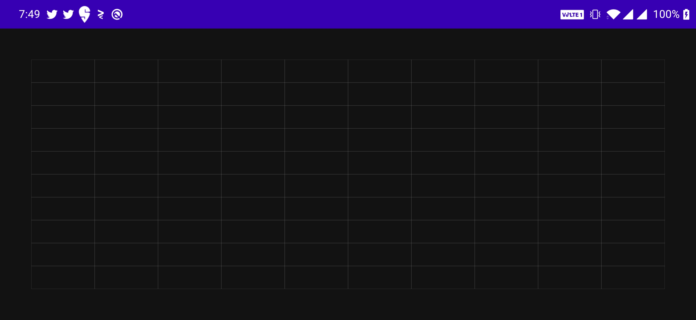
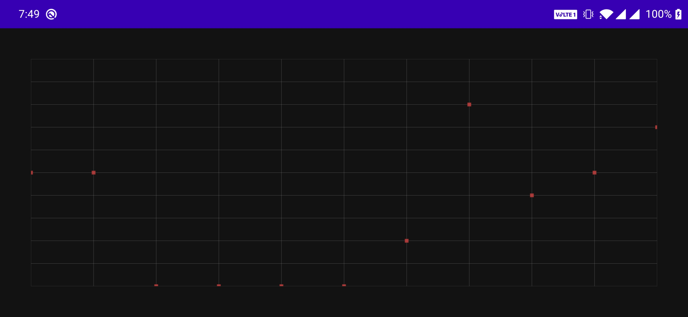
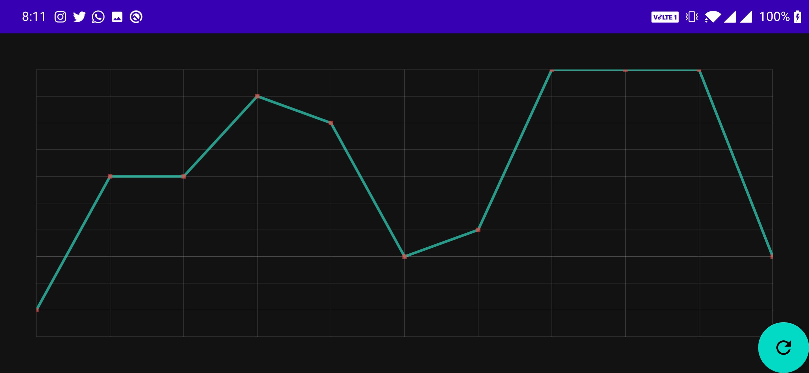
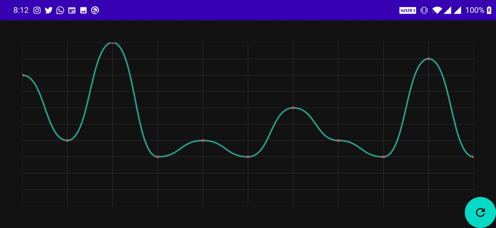

# Charter

A simple custom view demonstrating drawing line chart in canvas and animating it.

### Showcase

### Progress
1. Drawing axis lines

2. Plotting data points

3. Drawing lines along the data points

4. Drawing bezier curve along the data points

### Learning
* [Bezier curves](https://en.wikipedia.org/wiki/Bézier_curve) for drawing curved line paths
* [`PathMeasure.getSegment`](https://developer.android.com/reference/android/graphics/PathMeasure.html#getSegment(float%2C%20float%2C%20android.graphics.Path%2C%20boolean)) to copy a portion of a `Path` to a destination `Path` object

### Reference articles
* https://proandroiddev.com/drawing-bezier-curve-like-in-google-material-rally-e2b38053038c
* https://medium.com/androiddevelopers/playing-with-paths-3fbc679a6f77